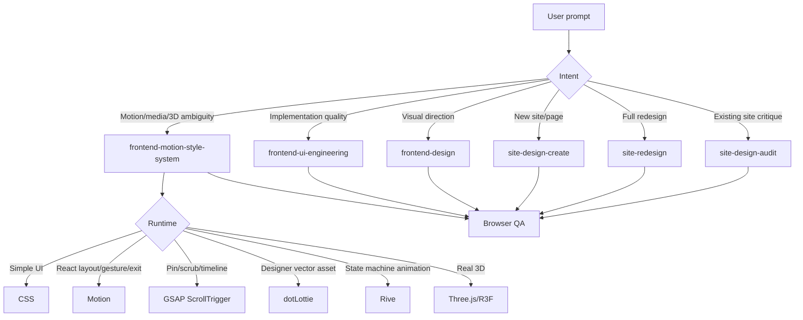

# Web Design Motion Skill Family

An installable Codex skill family for higher-quality AI-generated websites, frontend UI, motion design, and vibe coding.

This repository packages a practical web design and motion system for AI coding agents. It is designed to reduce generic AI website output, stale animation APIs, overused visual effects, fake proof blocks, and weak browser verification.

The system was developed by **Seva Gulian** with **Codex** as an AI co-developer.

Read the full article: [How We Built an AI Skill System for Web Design, Motion Design, and Vibe Coding](https://aicoding.am/blog/ai-web-design-motion-skill-system)

## One-command install

After this repository is published to GitHub:

```bash
curl -fsSL https://raw.githubusercontent.com/sevq1993-cyber/web-design-motion-skill-family/main/install.sh | bash
```

Then restart Codex so the new skills are discovered.

## What this installs

```text
skills/
├── frontend-motion-style-system
├── frontend-design
├── frontend-ui-engineering
├── site-design-audit
├── site-redesign
├── site-design-create
├── ui-designer
├── motion-react
├── gsap-scrolltrigger
├── lottie-animations
├── rive-interactive
└── lightweight-3d-effects
```

## Why this exists

AI coding agents can generate frontend code quickly, but speed alone does not produce good websites. Without clear routing, an agent may:

- turn a dashboard into a marketing landing page;
- add GSAP for simple fade-ins;
- invent fake metrics, testimonials, or customer logos;
- use outdated animation packages or CDN snippets;
- add hover-scale and pulse effects everywhere;
- ignore reduced motion, browser console errors, mobile overflow, or layout shift.

This skill family gives the agent a system:

- a router for visual, motion, media, and 3D ambiguity;
- visual direction rules for non-generic web design;
- UI engineering quality gates;
- clear audit/redesign/create-site workflows;
- motion runtime policy for CSS, Motion, GSAP, Lottie, Rive, and 3D;
- browser QA expectations;
- routing evals to prevent skill drift.

## Architecture



## Core policy

Use the smallest system that solves the product problem:

| Need | Default |
| --- | --- |
| Hover, focus, active, small reveal | CSS |
| React layout, gesture, exit, route transition | Motion |
| Pinned/scrubbed scroll storytelling | GSAP ScrollTrigger |
| Designer-exported vector animation | dotLottie/Lottie |
| Interactive state-machine animation | Rive |
| Real 3D scene | Three.js or React Three Fiber |
| Decorative pseudo-3D | CSS first, legacy/niche libraries only when justified |

## Example prompts

```text
Audit this local website and improve the visual quality. Open it in a browser,
check desktop and mobile, then fix the highest-impact design and UI issues.
Preserve routes, forms, SEO metadata, analytics hooks, legal copy, and existing
accessibility wins.
```

```text
Make this site feel more alive. Use frontend-motion-style-system as the router:
propose 2-4 meaningful motion moments, choose CSS/Motion/GSAP/Lottie/Rive by
complexity, implement the best ones, and verify reduced motion, mobile, console
errors, overflow, and layout shift.
```

```text
Create a new landing page for this product. Use site-design-create, then
frontend-design and frontend-ui-engineering. Do not invent fake metrics,
testimonials, logos, or trust claims.
```

## Validation

Run:

```bash
python3 scripts/validate-skills.py
```

The validator checks:

- every skill has valid frontmatter;
- `name` and `description` exist;
- linked `references/`, `scripts/`, and `assets/` paths exist;
- routing eval JSON parses;
- stale patterns are not present.

## Repository layout

```text
.
├── README.md
├── AUTHORS.md
├── LICENSE
├── install.sh
├── docs/
├── evals/
├── scripts/
└── skills/
```

## Security and privacy

This public package intentionally excludes:

- local machine paths;
- private project names;
- API keys and tokens;
- internal customer data;
- local Codex config;
- generated logs or browser sessions.

## License

MIT.
